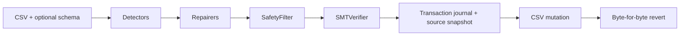
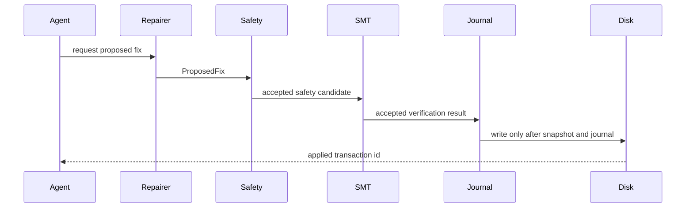
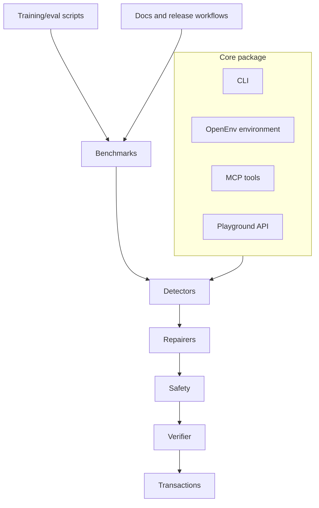

# Architecture

DataForge15 is the official release name for the DataForge codebase: a local,
auditable data-quality repair system. The core package is
kept separate from playground, training, and model-demo surfaces so the CLI can
remain installable without web or model dependencies.

## Runtime Layers

- **CLI and terminal UI**: Typer commands in `dataforge/cli/` with Rich output
  and a Textual constraint-review TUI. Public commands are `profile`, `repair`,
  `revert`, `watch`, `audit`, `bench`, and `constraints review`.
- **Detectors**: pandas-based scanners for `type_mismatch`, `decimal_shift`,
  and `fd_violation`. Detectors emit typed issues and never mutate data.
- **Repairers**: deterministic proposal generators for shipped detector
  families. Optional LLM fallback remains explicit and is not part of the
  default write path.
- **Safety**: constitution-backed policy checks that deny unsafe edits,
  row deletion, conflicting batch writes, and unconfirmed sensitive changes.
- **Verification**: Z3-backed SMT checks that reject fixes which violate schema
  constraints or cannot be proven safe.
- **Transactions**: append-only hash-chained JSONL journals, immutable source
  snapshots, post-state hash guards, local audit verification, and
  byte-for-byte revert.
- **Benchmarks**: Hospital, Flights, and Beers loaders, method runners, quota
  accounting, and generated markdown reports.
- **OpenEnv environment**: HTTP and in-process environment with typed actions:
  `INSPECT_ROWS`, `SQL_QUERY`, `STAT_TEST`, `PATTERN_MATCH`, `HYPOTHESIS`,
  `DIAGNOSE`, `FIX`, and `ROOT_CAUSE`.
- **Causal analyzer**: column-level DAG utilities, functional-dependency priors,
  PC discovery fallback, and minimal root-set analysis.
- **Playground**: React/Vite frontend deployed through Cloudflare Workers
  Static Assets, with runtime config in `config.js`, backed by a FastAPI API
  staged into a Hugging Face Docker Space.
- **Training and model demos**: SFT trajectory builders, GRPO reward/config
  hooks, readiness and release verifiers, Kaggle notebooks, Hub metadata, and a
  separate Gradio model-demo Space.
- **MCP integration**: nested standalone `dataforge-mcp/` source directory
  building the `dataforge15-mcp` package and exposing structured DataForge15
  tools over stdio by default.

## Safety Invariant

Every applied repair must follow this order:

Dry-run paths may stop before mutation, but they should exercise the same
proposal, safety, and verification logic where feasible. The CLI, MCP server,
playground API, and OpenEnv environment must preserve this invariant.

## Data And Control Flow

The core pipeline owns repair behavior. Surrounding surfaces can expose or test
the pipeline, but they should not create parallel write semantics.

## Dependency Guidance

Core runtime dependencies in `pyproject.toml`:

- `pandas` for tabular data handling.
- `pydantic` for typed issues, fixes, schemas, environment observations, and
  release evidence.
- `typer`, `rich`, and `textual` for CLI and constraint-review UX.
- `pyyaml` for schema and constitution loading.
- `z3-solver` for SMT verification.

Optional extras and scoped dependencies:

- `bench`: provider clients plus `pyarrow` for benchmark/data-loading paths.
- `causal`: `networkx`, `causal-learn`, `hyppo`, and `scipy`.
- `dev`: pytest, ruff, mypy, Hypothesis, benchmark, and Hub tooling.
- `train`: pinned Kaggle SFT/GRPO stack.
- `eval`: plotting libraries for evaluation summaries.
- `playground`: FastAPI, Uvicorn, multipart upload, and rate limiting.
- `providers`: `httpx`, `tenacity`, and `python-dotenv` for optional LLM calls.
- `openenv`: OpenEnv protocol dependency plus `duckdb`, `sqlglot`, and
  statistical/causal dependencies.
- `dataforge-mcp/`: source directory for the separate planned
  `dataforge15-mcp` PyPI package with MCP dependencies.
- `playground-model/`: Gradio and model-demo dependencies only.

## Release Boundaries

- `dataforge15` is the planned core CLI/library distribution. It is not
  published yet; `v0.1.0-rc1` is TestPyPI-only and real PyPI release tags should
  be created only after local gates, RC evidence, and PyPI trusted-publisher
  ownership are verified. It intentionally keeps the `dataforge` Python import
  namespace for the 0.1 line.
- `dataforge15-mcp` is the planned nested standalone distribution for
  `dataforge15-mcp-v*` release tags after PyPI ownership is verified.
- SFT datasets and checkpoints are Hugging Face artifacts verified by
  `scripts/model/verify_sft_release.py`.
- GRPO checkpoints are Hugging Face artifacts verified by
  `scripts/model/verify_grpo_release.py` before they can be cited as quality
  improvements.
- Generated Hugging Face staging directories are deployment artifacts, not
  canonical documentation sources.
