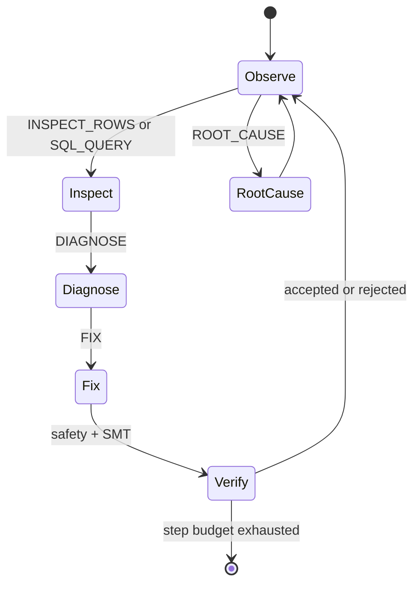

# Agent Loop

DataForge15 separates environment actions from repair execution. The agent loop
can inspect rows, query the in-memory dataset, run statistics, record
hypotheses, diagnose issues, propose fixes, and ask for root-cause analysis.

The loop is intentionally local and auditable. It does not require an LLM, and
the OpenEnv surface can be exercised entirely with deterministic actions.

## Design rules

- Tool actions are typed before dispatch.
- SQL actions are read-only and capped.
- Fix actions must pass the same safety and verification checks used by the CLI.
- Terminal reward is based on detection, fix quality, false positives, and step
  discipline.
