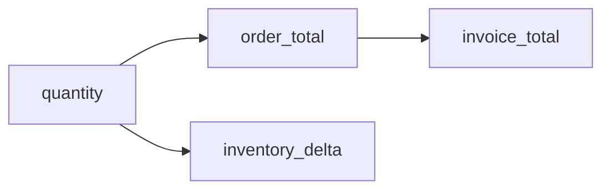

# Causal Root Cause

Root-cause analysis identifies the smallest upstream set of errors that can
explain selected downstream symptoms. It is useful for cascading data-quality
failures where fixing every visible issue independently would be misleading.

If errors appear in all four columns, the minimal root is usually `quantity`.
DataForge combines functional-dependency priors, causal discovery fallbacks, and
explicit error evidence to compute this minimal root set.

## Current scope

The 0.1.0 implementation is column-level and local to a dataset. It is not a
claim of causal truth about the external world.
