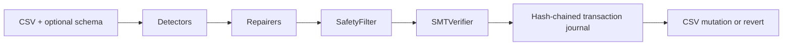

# DataForge15

DataForge15 is the official release name for the DataForge codebase. It is a
CLI-first toolkit for finding and repairing data-quality issues in tabular
files. It profiles CSVs, proposes deterministic repairs, checks
changes through safety and verification gates, and records applied fixes in a
reversible transaction log.

The planned PyPI distribution is `dataforge15`, but it is not published yet.
Install from this source checkout for now. The 0.1 line intentionally keeps the
Python import namespace as `dataforge`.

The 0.1.0rc1 release candidate is an alpha meant for local CSV profiling, repair
experiments, benchmarks, and training/evaluation research. It is not a
warehouse-native service, it does not make production model-quality claims, and
it does not claim design-partner or customer validation evidence yet.

## What ships in 0.1.0rc1

- `dataforge15 profile`, `dataforge15 repair`, `dataforge15 revert`,
  `dataforge15 watch`, `dataforge15 audit`, `dataforge15 bench`, and
  `dataforge15 constraints review`.
- Detector families for type mismatches, decimal shifts, and functional
  dependency violations.
- Reviewable `constraint_review_v1` artifacts with explicit accept/reject
  decisions before inferred constraints affect repair.
- Deterministic repairers wired through `SafetyFilter` and `SMTVerifier`.
- Append-only hash-chained transaction journals with immutable source snapshots.
- OpenEnv-compatible actions for data inspection, SQL, statistics, diagnosis,
  repair, and root-cause analysis.
- Benchmark scripts and generated reports for Hospital, Flights, and Beers.
- A React playground deployed through Cloudflare Workers Static Assets, backed
  by a Hugging Face Docker Space API.

## Benchmark Evidence

<!-- BENCH:START -->
Generated from `eval/results/agent_comparison.json` (schema `dataforge_benchmark_run_v2`, seeds `0, 1, 2`, git `dbd1bed0a03c`, dirty `true`).

| Method | Precision | Recall | F1 | Avg Steps | Quota Units | GPU Hours |
| --- | --- | --- | --- | --- | --- | --- |
| heuristic | 0.3167 | 0.3025 | 0.2772 | 374.33 | 0.0000 | 0.0000 |
| random | 0.0038 | 0.0003 | 0.0005 | 150.33 | 0.0000 | 0.0000 |

See `BENCHMARK_REPORT.md` for per-dataset tables, error bars, and citation-only SOTA rows.

Dataset bytes are pinned to BigDaMa/raha revision `7be1334b8c7bbdac3f47ef514fb3e1e8c5fc181c` for hospital, flights, beers; dirty/clean SHA-256s are recorded in the JSON metadata.
<!-- BENCH:END -->

## Core flow

## Start here

Run the [quickstart](quickstart.md) first. Use the [playground
guide](playground.md) for the hosted Analyze -> Risk -> Constraint Review ->
Verified Repairs -> Receipt surface, then read the
[architecture reference](architecture.md) if you need the full mental model
before extending the system.
