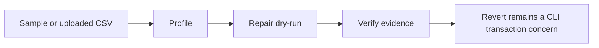

# Playground

The DataForge playground is the browser surface for the same safety model as
the CLI: profile the data, preview repairs, verify the evidence, and keep
revert semantics clear. It is built for quick practitioner review, not account
management or production data processing.

## Workflow

1. **Profile**: send a sample dataset or a locally validated CSV upload to the
   Hugging Face API. The frontend previews rows before upload and enforces the
   hosted 1 MiB limit.
2. **Repair**: request dry-run proposals only. The hosted playground does not
   mutate files and does not write browser storage.
3. **Verify**: inspect issue groups, provenance, severity, repair diffs, and
   the ephemeral dry-run journal before copying or exporting evidence.
4. **Revert**: use the CLI for applied transactions. Browser dry-runs never
   create a transaction that needs reversal.

## Runtime Split

- **Cloudflare Workers Static Assets** serves the React/Vite frontend from
  `playground/web/dist`.
- **Hugging Face Docker Space** serves the FastAPI backend with stable
  `/api/health`, `/api/samples/{name}`, `/api/profile`, and `/api/repair`
  routes.
- **Runtime config** lives in `playground/web/public/config.js` and is rendered
  before deployment. It contains only the backend URL and must be served with
  `Cache-Control: no-store`.
- **Hashed assets** are long-cacheable. The frontend itself has no API keys and
  no client-side persistence.

The health contract is part of the public interface. A deployed backend must
return `status`, `advanced_available`, and `max_upload_bytes`; advanced UI
controls stay gated by that capability response.

## Safety Boundaries

- Dry-run only in the browser.
- No accounts, cookies, or browser storage.
- No frontend API keys.
- Client-side type, size, and header checks before upload.
- Exact-origin production CORS from the backend.
- RFC 9457 `application/problem+json` handling for user-facing API errors.
- Exported evidence is generated on demand from in-memory results.

## Model Demo

The separate Gradio Space for
[DataForge-0.5B-SFT](https://huggingface.co/Praneshrajan15/DataForge-0.5B-SFT)
is intentionally labeled as experimental. It can propose repairs for short CSV
snippets, but it does not apply fixes, does not produce verified transaction
evidence, and should not be cited as the authoritative product workflow.

## Deployment Checks

Follow `playground/web/DEPLOY.md` for Cloudflare deployment and
`playground/api/SPACE_SETUP.md` for the Hugging Face backend. A release is not
ready until verification confirms that Cloudflare serves the React app, the
Hugging Face root serves API metadata, `/api/health` matches the capability
contract, and CORS allows only the intended frontend origin.
