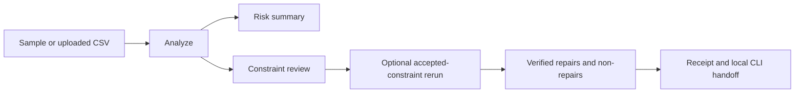

# Playground

The DataForge15 playground is the browser proof loop for the core product
promise: upload messy CSV data, understand risk, review inferred assumptions,
inspect verified repair proposals, and leave with an auditable apply handoff.
It is built for quick practitioner review, not account management or production
data processing.

## Workflow

1. **Analyze**: send a sample dataset or locally validated CSV upload to
   `POST /api/analyze`. The frontend previews rows before upload and enforces
   the hosted 1 MiB limit.
2. **Review risk**: the response uses categorical dataset risk and repair
   readiness. It does not expose fake precision scores.
3. **Review assumptions**: inferred constraints are `pending` by default.
   Only repair-supported candidates can be checked in the browser, and accepted
   IDs live in per-run memory only.
4. **Verify repairs**: dry-run evidence includes verified fixes,
   attempted-but-not-fixed items, abstentions, safety verdict, verifier verdict,
   provenance, and source hash.
5. **Apply handoff**: the browser never mutates uploads. The receipt shows the
   local CLI command shape for dry-run, apply, audit, and revert.

## Runtime Split

- **Cloudflare Workers Static Assets** serves the React/Vite frontend from
  `playground/web/dist`.
- **Hugging Face Docker Space** serves the FastAPI backend with stable
  `/api/health`, `/api/samples/{name}`, `/api/analyze`, `/api/profile`, and
  `/api/repair` routes. `/api/profile` and `/api/repair` remain compatibility
  routes; `/api/analyze` is the primary playground workflow.
- **Runtime config** lives in `playground/web/public/config.js` and is rendered
  before deployment. It contains only the backend URL and must be served with
  `Cache-Control: no-store`.
- **Hashed assets** are long-cacheable. The frontend itself has no API keys and
  no client-side persistence.

The health contract is part of the public interface. A deployed backend must
return `status`, `advanced_available`, and `max_upload_bytes`; advanced UI
controls stay gated by that capability response.

## API Contract

`POST /api/analyze` accepts multipart `file`, optional `advanced=true`, and an
optional `accepted_constraint_ids` JSON form field. It always runs dry-run only.

The response includes:

- `source`
- `schema_inference`
- `risk_summary`
- `issues`
- `repairs`
- `verification`
- `txn_journal`
- `receipt`
- `apply_handoff`
- `limitations`

Unknown accepted constraint IDs return `400 application/problem+json` with
`error="unknown_constraint_id"`.

## Safety Boundaries

- Dry-run only in the browser.
- No accounts, cookies, or browser storage.
- No frontend API keys.
- Client-side type, size, and header checks before upload.
- Exact-origin production CORS from the backend.
- RFC 9457 `application/problem+json` handling for user-facing API errors.
- Exported evidence is generated on demand from in-memory results.
- Local CLI transactions remain the only apply and revert write path.

## Model Demo

The separate Gradio Space for the historical
[DataForge-0.5B-SFT](https://huggingface.co/Praneshrajan15/DataForge-0.5B-SFT)
checkpoint is intentionally labeled as experimental. New public model and Space
artifacts should use DataForge15 names. The demo can propose repairs for short
CSV snippets, but it does not apply fixes, does not produce verified transaction
evidence, and should not be cited as the authoritative product workflow.

## Deployment Checks

Follow `playground/web/DEPLOY.md` for Cloudflare deployment and
`playground/api/SPACE_SETUP.md` for the Hugging Face backend. A release is not
ready until verification confirms that Cloudflare serves the React app, the
Hugging Face root serves API metadata, `/api/health` matches the capability
contract, `/api/analyze` returns proof-loop evidence, and CORS allows only the
intended frontend origin.
